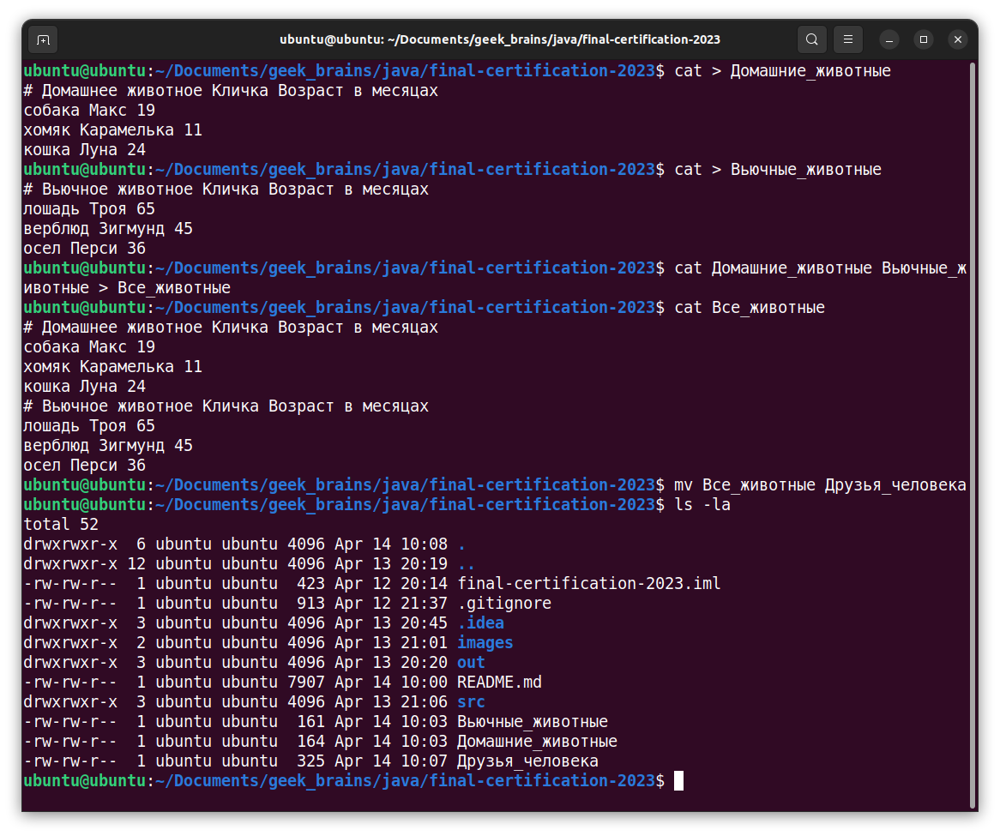
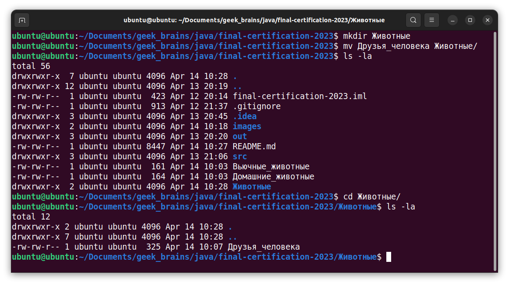
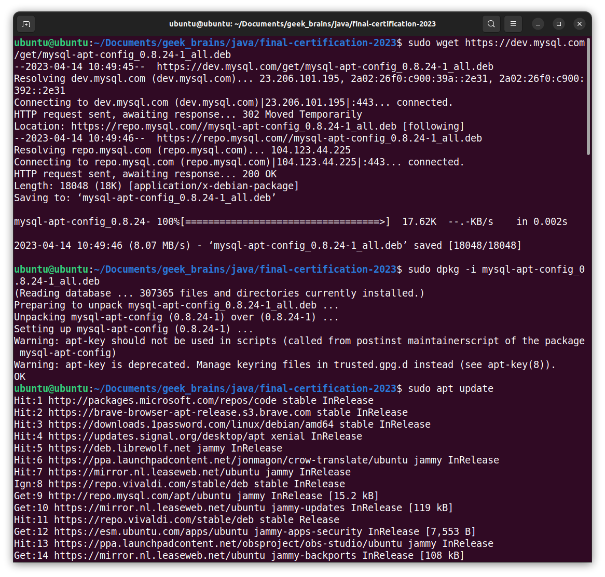
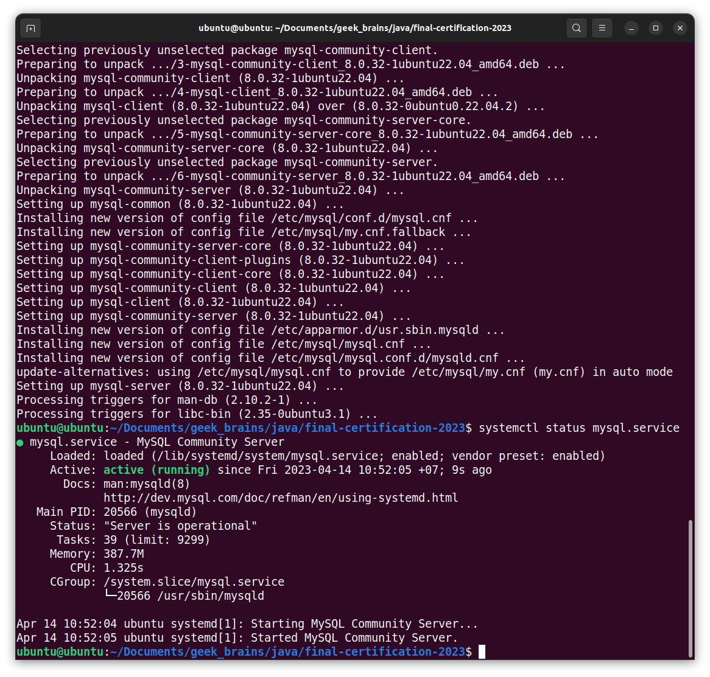
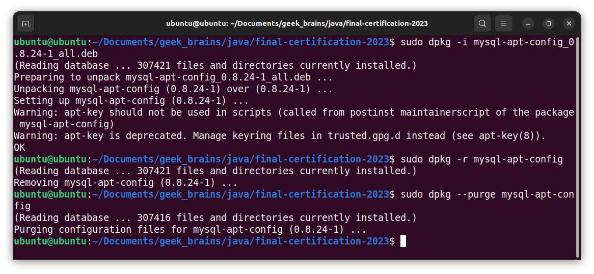
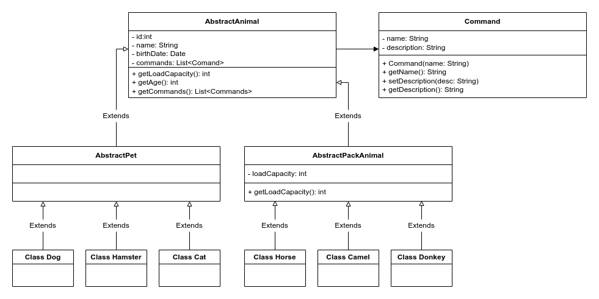
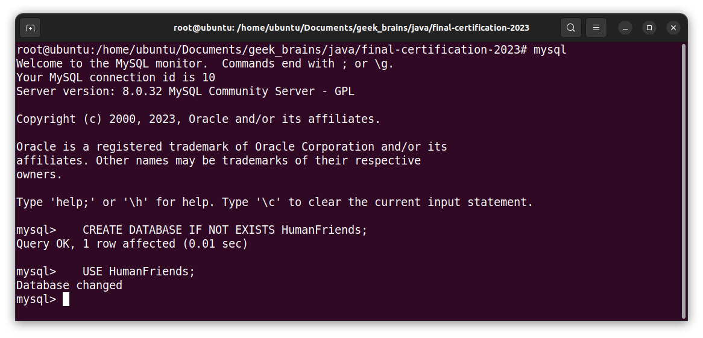
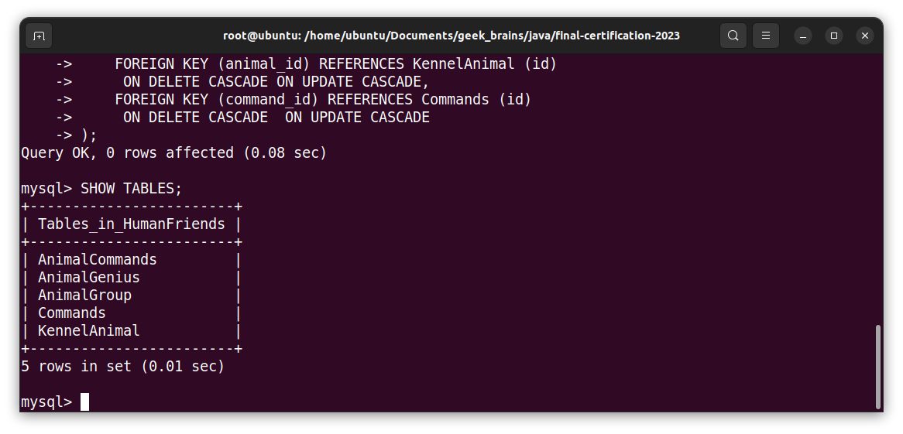

# Итоговая aттecтaция, апрель 2023

## 🟥 Инфopмaция o пpoeктe

Необходимо организовать систему учета для питомника, в котором живут домашние и вьючные животные.

## 🟧 Зaдaниe

### 1. Задание на проверку навыков работы в операционной системе Linux Ubuntu

1.1. Используя команду `cat` в терминале операционной системы `Linux`, создать два файла:
  - `Домашние животные` (заполнив файл `собаками`, `кошками`, `хомяками`)
  - `Вьючные животные` (заполнив файл `лошадьми`, `верблюдами`, `ослами`)

Затем объединить их. Просмотреть содержимое созданного файла. Переименовать файл, дав ему новое имя - `Друзья человека`.

1.2. Создать директорию, переместить файл туда  
1.3. Подключить дополнительный репозиторий `MySQL`. Установить любой пакет из этого репозитория  
1.4. Установить и удалить `deb-пакет` с помощью `dpkg`  
1.5. Выложить историю команд в терминале `Ubuntu`  

### 2. Задание на проверку навыков работы c MySQL

2.1. Нарисовать диаграмму, в которой есть класс родительский класс, домашние животные и вьючные животные, в составы которых в случае `домашних животных` войдут классы: `собаки`, `кошки` и `хомяки`, а в класс `вьючные животные`
войдут: `лошади`, `верблюды` и `ослы`  
2.2. В подключенном `MySQL` репозитории создать базу данных `Друзья человека`  
2.3. Создать таблицы с иерархией из диаграммы в БД  
2.4. Заполнить низкоуровневые таблицы `именами животных`, `командами` которые они выполняют и `датами рождения`  
2.5. Объединить таблицы `лошади` и `ослы` в одну таблицу, удалив из таблицы `верблюдов`, так как верблюдов решили перевезти в другой питомник на зимовку  
2.6. Создать новую таблицу `молодые животные` в которую попадут все животные старше `1` года, но младше `3` лет и в отдельном столбце с точностью до месяца подсчитать возраст животных в новой таблице  
2.7. Объединить все таблицы в одну, при этом сохраняя поля, указывающие на прошлую принадлежность к старым таблицам  

### 3. Заключительное задание итоговой aттecтaции

3.1. Создать класс с __инкапсуляцией__ методов и наследованием по диаграмме  
3.2. Написать программу, имитирующую работу реестра домашних животных  
3.3. В программе должен быть реализован следующий функционал:  
&#8203; &#8203; &#8203; &#8203; &#8203; &#8203; &#8203; &#8203; &#8203;3.3.1. *Заводить новое животное*  
&#8203; &#8203; &#8203; &#8203; &#8203; &#8203; &#8203; &#8203; &#8203;3.3.2. *Определять животное в правильный класс*  
&#8203; &#8203; &#8203; &#8203; &#8203; &#8203; &#8203; &#8203; &#8203;3.3.3. *Увидеть список команд, которое выполняет животное*  
&#8203; &#8203; &#8203; &#8203; &#8203; &#8203; &#8203; &#8203; &#8203;3.3.4. *Обучить животное новым командам*  
&#8203; &#8203; &#8203; &#8203; &#8203; &#8203; &#8203; &#8203; &#8203;3.3.5. *Реализовать навигацию по меню*  
3.4. Создайте класс `Счетчик`, у которого есть метод `add()`, увеличивающий начение внутренней `int` переменной на `1` при нажатии `Завести новое животное`. Сделайте так, чтобы с объектом такого типа можно было работать в блоке `try-with-resources`. Нужно бросить исключение, если работа с объектом типа счетчик была не в ресурсном `try` и/или ресурс остался открыт. Значение считать в ресурсе `try`, если при заведении животного заполнены все поля  

## 🟩 Cтpyктypa пpoeктa

```txt
java/
└─ final-certification-2023/
   ├─.gitignore
   └─ README.md
```

Пpoeкт итоговой аттестации cтpyктypиpoвaн в oднoм кaтaлoгe. Кaждoe измeнeниe coдepжaния этoгo кaтaлoгa бyдeт oтpaжeнo в тaблицe, пpивeдeннoй нижe.

Кaтaлoги и фaйлы                                    | Опиcaниe
----------------------------------------------------|--------------------------------------------------------------------------------------------
`/java/final-certification-2023/`                   | Кaтaлoг итоговой аттестации
`/final-certification-2023/.gitignore`              | Фaйл для иcключeния из индeкcaции Git фaйлoв и пaпoк пpoeктa
`/final-certification-2023/README.md`               | Oпиcaниe зaдaчи, eё peшeния, a тaкжe дpyгих фaйлoв пpoeктa

## 🟦 Решение

### 1. Задание на проверку навыков работы в операционной системе Linux Ubuntu

<details>
<summary><b>1.1.</b></summary>

Создаем файл `Домашние_животные` и вводим в него данные с клавиатуры:

```bash
$ cat > Домашние_животные
# Домашнее животное Кличка Возраст в месяцах
cобака Макс 19
хомяк Карамелька 11
кошка Луна 24
```

Нажимаем `Ctrl+D` для сохранения данных.

Создаем файл `Вьючные_животные` и вводим в него данные с клавиатуры:

```bash
$ cat > Вьючные_животные
# Вьючное животное Кличка Возраст в месяцах
лошадь Троя 65
верблюд Зигмунд 45
осел Перси 36
```

Нажимаем `Ctrl+D` для сохранения данных.

Объединяем созданные файлы `Домашние_животные` и `Вьючные_животные`:

```bash
$ cat Домашние_животные Вьючные_животные > Все_животные
```

Просмотриваем содержимое созданного файла `Все_животные`:

```bash
$ cat Все_животные
```

Переименовываем файл `Все_животные` в `Друзья_человека`:

```bash
$ mv Все_животные Друзья_человека
```



</details>

<details>
<summary><b>1.2.</b></summary>

Создаем директорию `Животные`:

```bash
$ mkdir Животные
```

Перемещаем файл `Друзья_человека` в директорию `Животные`:

```bash
$ mv Друзья_человека Животные/
```



</details>

<details>
<summary><b>1.3.</b></summary>

Подключаем дополнительный репозиторий `MySQL`. Устанавливаем любой пакет из этого репозитория:

```bash
$ sudo wget https://dev.mysql.com/get/mysql-apt-config_0.8.24-1_all.deb
$ sudo dpkg -i mysql-apt-config_0.8.24-1_all.deb
$ sudo apt update
$ sudo apt install mysql-server mysql-client
$ systemctl status mysql.service
```




</details>

<details>
<summary><b>1.4.</b></summary>

Установливаем и удаляем `deb-пакет` с помощью `dpkg`:

```bash
$ sudo dpkg -i mysql-apt-config_0.8.24-1_all.deb
$ sudo dpkg -r mysql-apt-config
$ sudo dpkg --purge mysql-apt-config
```



</details>

<details>
<summary><b>1.5.</b></summary>

Подтверждение истории команд в терминале для заданий с 1.1. по 1.4.:


</details>

### 2. Задание на проверку навыков работы c MySQL

<details>
<summary><b>2.1.</b></summary>

Диаграмма классов:


 
</details>

<details>
<summary><b>2.2.</b></summary>

Cоздаем базу данных `Друзья человека`:

```sql
CREATE DATABASE IF NOT EXISTS HumanFriends;
USE HumanFriends;
```



</details>

<details>
<summary><b>2.3.</b></summary>

Создаем таблицы с иерархией из диаграммы в БД:

```sql
CREATE TABLE Commands
(
    id INT PRIMARY KEY NOT NULL AUTO_INCREMENT,
    name varchar(30),
    description varchar(255)
);

CREATE TABLE AnimalGroup
(
    id INT PRIMARY KEY NOT NULL AUTO_INCREMENT,
    name varchar(30)
);
   
CREATE TABLE AnimalGenius
(
    id INT PRIMARY KEY NOT NULL AUTO_INCREMENT,
    name varchar(30),
    group_id INT,
    FOREIGN KEY (group_id) REFERENCES AnimalGroup (id)
    ON DELETE CASCADE ON UPDATE CASCADE
);
   
CREATE TABLE KennelAnimal
(
    id INT PRIMARY KEY NOT NULL AUTO_INCREMENT,
    name varchar(30),
    birthDate DATE,
    genius_id INT,
    FOREIGN KEY (genius_id) REFERENCES AnimalGenius (id)
    ON DELETE CASCADE ON UPDATE CASCADE
);
   
CREATE TABLE AnimalCommands
(
    animal_id INT NOT NULL,
    command_id INT NOT NULL,

    PRIMARY KEY (animal_id, command_id),
    FOREIGN KEY (animal_id) REFERENCES KennelAnimal (id)
     ON DELETE CASCADE ON UPDATE CASCADE,
    FOREIGN KEY (command_id) REFERENCES Commands (id)
     ON DELETE CASCADE  ON UPDATE CASCADE
);
```



</details>
