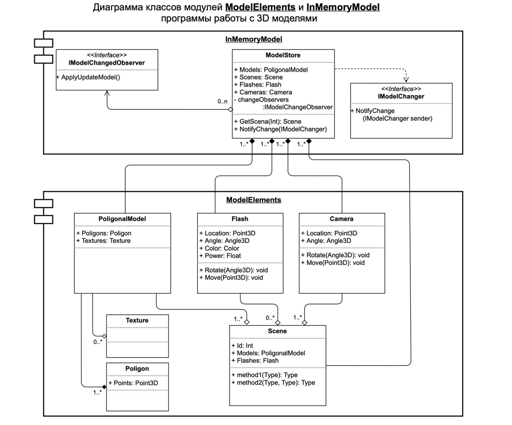

# Архитектура ПО. Введение в понятие архитектуры, проектирование ПО и жизненный цикл программного продукта. UML-диаграммы. Семинар 1. Домашнее задание

### Описание:

На основе Диаграмы классов `ModelElements`, разработать классы: `Model Store`, `PoligonalModel` (`Texture`, `Poligon`), `Flash`, `Camera`, `Scene`.

