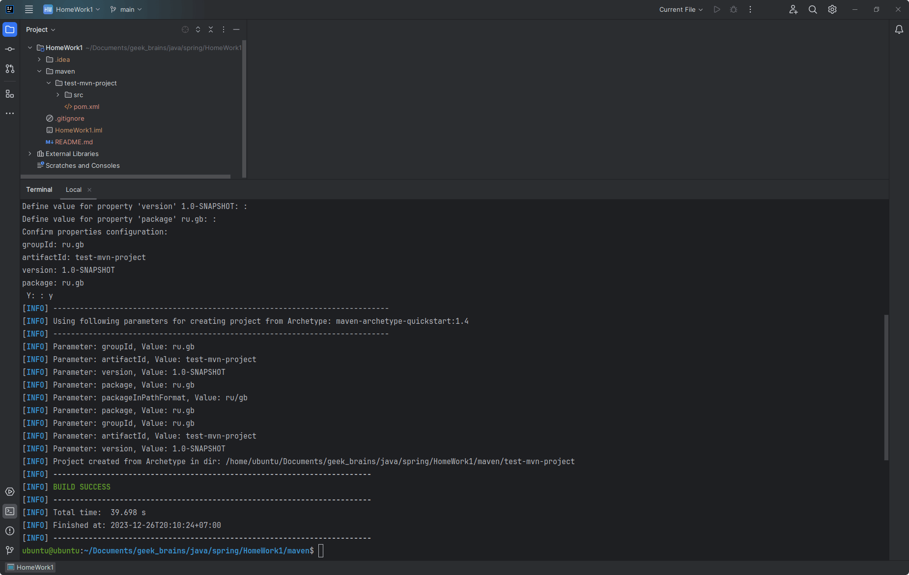

# Фреймворк Spring. Системы сборки Maven и Gradle для разработки Java приложений. Семинар 1. Домашнее задание

1. Установить себе `maven` или `gradle` (если еще не установлено). Удобно использовать `sdkman` `https://sdkman.io/`

2. С помощью сборщика сгенерировать проект.

3. Выполнить команду по выполнению сборки.

4. Сделать скриншот результатов сборки и прислать в качестве ДЗ.

